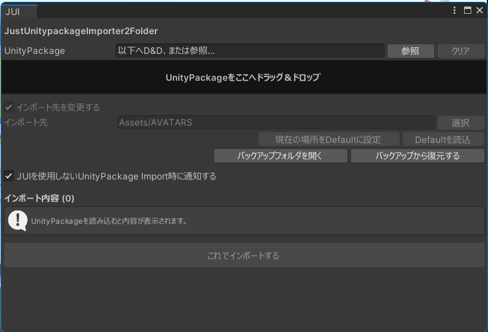

# JustUnitypackageImporter2Folder

JustUnitypackageImporter2Folder（JUI）は、`.unitypackage` 内のフォルダ構造を維持したまま、任意の `Assets` フォルダ配下へインポートできるUnity Editor拡張です。

Unity標準のUnityPackage Importを置き換えるものではありません。保存先の変更は、JUIウィンドウからインポートした場合にのみ適用されます。

# JustUnitypackageImporter2Folder



## 主な機能

- UnityPackageのインポート先を任意の `Assets` フォルダ配下へ変更
- UnityPackage内のAssetをツリー形式・罫線付きで事前表示
- 複数のトップレベル項目をPackage名のフォルダへまとめてImport
- UnityPackage読込時に既存プロジェクトとのGUID競合を検査して自動除外
- ファイルまたはフォルダ単位でImport対象を選択
- ツリーの一括展開・折りたたみ、全項目の一括選択・解除
- デフォルトImport先をプロジェクト単位の `EditorUserSettings` に保存
- 同名ファイル、ファイル／フォルダの種別競合、GUID競合を確認
- 上書き前のファイルを `JUI_BAK` へバックアップ
- バックアップから上書き前の状態へ復元
- JUIを使用しない通常のUnityPackage Importを検出して通知
- Import、バックアップ、復元、警告などの操作内容をUnity Consoleへ出力

## 動作環境

- Unity 2022.3世代のEditor APIを想定
- Unity Editor専用
- `.unitypackage` 形式に対応
- Import先はプロジェクトの `Assets` フォルダ内に限定

> [!NOTE]
> UPM PackageのImport先変更には対応していません。

## インストール

1. Unityプロジェクト内に次のフォルダを作成します。

   ```text
   Assets/Editor/JUI/
   ```

2. `JUI.cs` を作成したフォルダへ配置します。

   ```text
   Assets/Editor/JUI/JUI.cs
   ```

3. Unityによるスクリプトのコンパイル完了後、メニューに `Tools > JUI` が追加されます。

## 基本的な使い方

1. Unity Editorの `Tools > JUI` を開きます。
2. `.unitypackage` をウィンドウへドラッグ＆ドロップするか、「参照」から選択します。
3. 「インポート先を変更する」のON/OFFを選択します。
4. UnityPackageのトップレベル項目が複数ある場合は、一つのフォルダへまとめるか選択します。
5. ONの場合は、インポート先となる `Assets` 配下のフォルダを指定します。
6. ツリーに表示された内容を確認し、不要なAssetのチェックを外します。
7. 「これでインポートする」を押します。
8. 競合警告と最終確認を確認してImportを実行します。

Importが正常に完了すると、UnityPackage入力欄と内容一覧はクリアされます。

### UnityPackageの入力とクリア

D&D領域は通常時に暗色で表示され、有効な `.unitypackage` を領域上へドラッグしている間は明るい色へ変化します。対応していないファイルは受け付けません。

UnityPackage入力欄の「クリア」を押すと、次の読込状態を手動で初期化できます。

- UnityPackageの入力パス
- Import内容一覧
- 読み込みエラー
- トップレベル項目のまとめ設定とフォルダ名
- 一覧のスクロール位置

Import先と保存済みのDefault設定はクリアされません。クリア操作はUnity Consoleにも記録されます。

## Import先の変更

「インポート先を変更する」がONの場合、指定フォルダを基準に元Packageの相対フォルダ構造を維持して配置します。

元Package:

```text
Assets/
├─ Avatar/
├─ Materials/
└─ Textures/
```

Import先:

```text
Assets/_AvatarArchive/Alice/
```

Import結果:

```text
Assets/_AvatarArchive/Alice/
├─ Avatar/
├─ Materials/
└─ Textures/
```

OFFの場合は、UnityPackageに記録された元の `Assets/...` パスへ配置します。

## 複数のトップレベル項目をまとめる

UnityPackageの `Assets` 直下にフォルダまたはファイルが2項目以上ある場合、次の確認を表示します。

> UnityPackage内に複数のフォルダ・ファイルがあります。一つのフォルダにまとめますか？

「まとめる」を選択すると、現在のImport先直下へ専用フォルダを1階層追加し、その中へPackage内容を配置します。

```text
Import先/
└─ PackageName/
   ├─ Avatar/
   ├─ Materials/
   └─ README.txt
```

専用フォルダ名の初期値は、読み込んだ `.unitypackage` の拡張子を除いたファイル名です。「まとめ先フォルダ名」欄でImport前に変更できます。

フォルダ名が10文字以上の場合は、UI上に長いフォルダ名であることを示す注意文が表示されます。

## デフォルトImport先

「現在の場所をDefaultに設定」を押すと、現在のImport先を保存できます。「Defaultを読込」で保存済みの場所を再設定します。

保存にはUnityの `EditorUserSettings` を使用するため、Unity Editorを終了した後もプロジェクト単位で設定が保持されます。他のUnityプロジェクトとは共有されません。

## Import内容の選択

UnityPackageを読み込むと、内容がフォルダ階層に沿ったツリーで表示されます。

- Assetのチェックを外すと、そのAssetはImportされません。
- フォルダのチェックを変更すると、配下の項目を一括で選択・解除します。
- 配下の一部だけが選択されているフォルダは、中間選択状態で表示されます。
- 「すべてON」「すべてOFF」で全項目を一括変更できます。
- 「すべて展開」「すべて折りたたむ」でツリーの表示状態を変更できます。

> [!WARNING]
> 依存Assetを除外すると、Prefab、MaterialなどでMissing参照が発生する可能性があります。JUIは依存関係や参照切れを自動修復しません。

## 競合と上書き

Import前に既存Assetとの競合を確認します。警告ダイアログには検出件数のみ表示され、対象パスやGUIDなどの詳細はUnity Consoleへ出力されます。

既存ファイルが上書き対象になった場合は、次の操作を選択できます。

- 「バックアップして上書き」
- 「キャンセル」
- 「バックアップしないでインポートする」

バックアップせずに上書きしたファイルは、JUIの復元機能では元に戻せません。

## バックアップ

「バックアップして上書き」を選択すると、上書き対象のAssetと対応する `.meta` をImport前に複製します。

バックアップはUnityプロジェクト直下へ、日時ごとに保存されます。

```text
UnityProject/
└─ JUI_BAK/
   └─ yyyyMMdd_HHmmss_fff/
      └─ Assets/
         └─ ...
```

「バックアップフォルダを開く」を押すと、`JUI_BAK` をファイルブラウザーで開きます。

### バックアップから復元する

1. 「バックアップから復元する」を押します。
2. `JUI_BAK` 内から復元する日時のフォルダを選択します。
3. 対象ファイル数を確認します。
4. 「本当に復元しますか？」の確認で「復元する」を選択します。

バックアップに含まれるAssetと `.meta` が、元の `Assets/...` へ上書きコピーされます。復元後は `AssetDatabase.Refresh` が実行されます。

> [!CAUTION]
> 復元操作も現在のファイルを上書きします。選択するバックアップ世代を十分に確認してください。

## 通常Importの通知

JUIを使わずにUnity標準のUnityPackage Importを開始すると、次の内容を通知します。

> JUIを使用していないため、インポート先は変更されません。

通知は標準Importを中止・変更しません。「JUIを使用しないUnityPackage Import時に通知する」のチェックを外すと無効にできます。初期値はONです。

## Consoleログ

JUIによる次の操作や警告は、`[JUI]` プレフィックス付きでUnity Consoleへ出力されます。

- UnityPackageの読み込み
- Importの開始・完了・失敗
- 競合内容と上書き対象
- バックアップの作成
- バックアップからの復元
- Default Import先などの設定変更
- JUIを使用しない通常Importの検出

## GUIDと参照

JUIはUnityPackage内の `asset.meta` を維持して配置し、Prefab、Material、TextureなどのGUIDベースの参照関係を可能な限り保持します。

Import前には、同名ファイルやファイル／フォルダの種別競合に加え、既存Assetと異なるパスで同じGUIDが使用されるケースを警告します。

### 読込時のGUID競合検査

UnityPackageをJUIへ追加した時点で、各ファイルの `.meta` GUIDを現在のプロジェクトと照合します。既存AssetとGUIDが競合したファイルは、誤ってImportされないよう次の状態になります。

- Import対象のチェックを自動的に解除
- ツリーの該当行を薄い黄色でハイライト
- ファイル名の先頭に警告記号 `⚠` を表示
- マウスオーバー時に競合している既存Assetのパスを表示
- Package内パス、GUID、既存AssetパスをUnity Consoleへ警告出力

自動除外されたファイルは、内容を確認したうえで手動による再選択も可能です。

## 対象外の機能

現在、次の処理は行いません。

- Unity標準ImportのキャンセルやJUIへの強制転送
- Shader内部名の変更
- Script namespaceの変更
- Asset依存関係の解析・自動修復
- Missing参照の自動修正
- 外部Package依存関係の自動解決
- UPM PackageのImport先変更

## 注意事項

- 重要なUnityプロジェクトでは、JUIのバックアップに加えてバージョン管理も使用してください。
- Import対象から除外したAssetによる参照切れは自動修復されません。
- GUID競合の警告が表示された場合は、Unity Consoleの詳細を確認してから続行してください。
- 元の `.unitypackage` ファイル自体は変更されません。

## ファイル

- `JUI.cs` — Unity Editor拡張本体
- `Specification.md` — 暫定仕様書
- `仕様書（人力版）.txt` — 機能概要と更新記録
